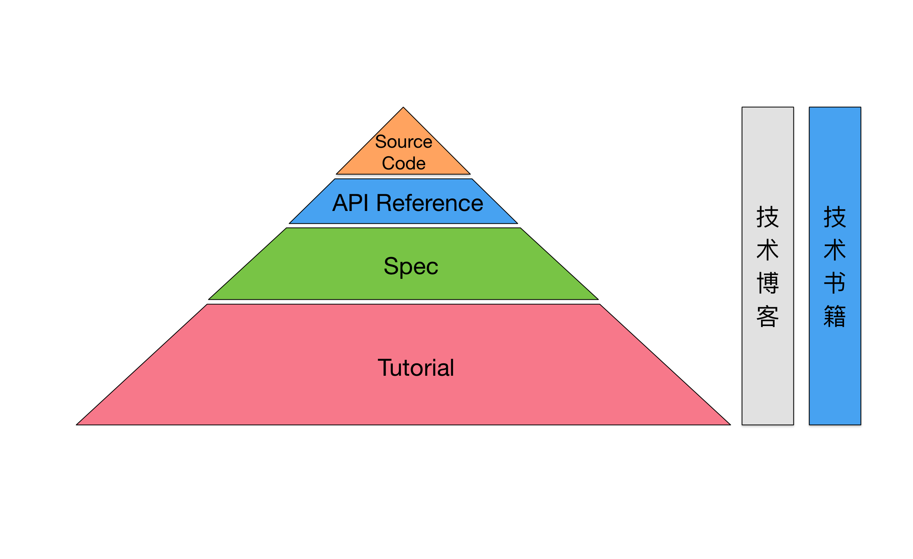

> I always believe that to be the best, you have to smell like the best, dress like the best, act like the best. When you throw your trash in the garbage can, it has to be better than anybody else who ever threw trash in the garbage can.

.   
.   

> “优秀绝非偶然. 它总是由强烈的意图、真诚的付出以及聪明的行动带来的。优秀代表着明智的选择——选择，而不是机会，它会决定着你的命运。“

### 面对一项新技术的时候，我们怎样去学习才能循序渐进，最终理解得深刻？

让我们先把可供自学的资料列出来，分析一下：

* Tutorial（入门教程）。由该项技术的官网提供。通常是英文的。这份资料是给初次接触该项技术的人看的，一般是一步一步地教你完成某些例子。当我们说某项技术对于新手不太友好的时候，一般也是因为这项技术的Tutorial部分做得不够好。
* Specification，简称Spec。这是集中体现该项技术的设计思想的东西，是高度抽象的描述。这个一般也是一份完备的、系统的描述，包含该项技术涉及到的方方面面。这部分资料在不同的地方叫法不同，在相对简单的技术项目中，也可能没有；在另一些情况下，这部分资料混杂在其它文档资料之中；它还可能以论文（paper）的形式出现。
* API Reference。大而全的API索引和文档，针对不同的语言接口可能提供多份。当我们使用这项技术进行编程的时候，API Reference自然是个离不开的、总是要不停去查询的一份资料。
* 别人写的技术博客。质量良莠不齐，到底有没有价值，我们要学会去分辨。
* 技术书籍。跟技术博客类似，质量有好有坏。稍后我们和技术博客放在一起来分析。
* Source Code。如果我们要学习的技术是开源的，那么很幸运，我们能得到源代码。这是一份终极资料。

### Java语言

从来没有接触过Java语言的人，要想开始自学Java，从哪里开始呢？可以从Oracle官方提供的Tutorial入手：

* http://docs.oracle.com/javase/tutorial/
这份资料《The Java™ Tutorials 》，集中体现了Tutorial类型的资料的特点。它从最开始的编译和运行环境搭建说起，教你写出第一个Hello World，再用介绍的方式将Java各种语言特性（变量、类、泛型、Lambda表达式、JavaBeans，等等）进行讲解，同时还有对于JDK里常用API（集合类、多线程、IO等等）的介绍。

对初学者而言，需要的就是这样一份资料。即使你手头没有任何Java的入门书籍，读完这样的一份资料之后，一个新手基本就可以开始使用Java来编程了。

再看Spec：

* http://docs.oracle.com/javase/specs/jls/se8/html/index.html
这份文档，叫做《The Java® Language Specification》。是一份很典型的Spec，完备而规范。

任何讲Java语法的资料，包括各种书籍和前面提到的Tutorial，都只能涉及部分。而这份Spec，如果你能读通的话，那么与Java语言特性有关的所有一切，你就再也不用求人了。

JDK 8的API Reference:

* http://docs.oracle.com/javase/8/docs/api/index.html
用Java语言编程的时候，我们需要不断查阅的就是这份API Reference。我们平常一般是通过IDE来快速查看某个接口的文档说明。

## some greate things should know
* [Electron](http://electron.atom.io/)
* [Vue](http://vuejs.org/)
* [Katex](https://github.com/Khan/KaTeX)
* [Animate.css](https://daneden.github.io/animate.css/)
* [Marked](https://github.com/chjj/marked)
* [mermaid](https://github.com/knsv/mermaid)
* [Marp](https://yhatt.github.io/marp/)